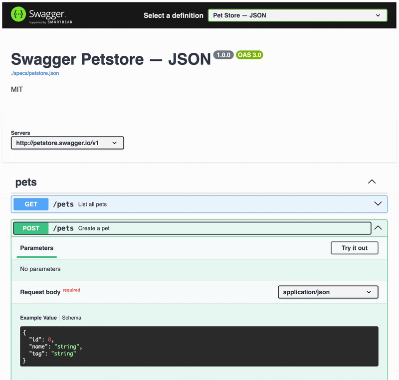

# vite-swagger-ui

> Swagger UI powered by Vite with built-in support for multiple APIs.

## What this is

It's hard to beat Swagger UI when looking for a free way to visualize and interact with your OpenAPI APIs.

It is not trivial, though, to deploy Swagger UI or configure it to support multiple APIs.

This project changes that and pre-configures Vite and Swagger UI for you. Just bring your spec files and run.

## How to use it

1. Clone this repo

```bash
git clone https://github.com/lukefernandez/vite-swagger-ui.git
```

2. Install dependencies

```bash
cd vite-swagger-ui
pnpm install
```

3. Configure the `urls` array in `src/main.ts` to point to your JSON and/or YAML API spec files. Two examples are included that reference specs in the `public/specs/` directory.

4. Deploy and view as you would any other Vite project. Toggle between APIs using the dropdown at the top right of the page.

```bash
# Run development server
pnpm run dev

# Or build for production and preview
pnpm run build
pnpm run preview
```

## Demo


